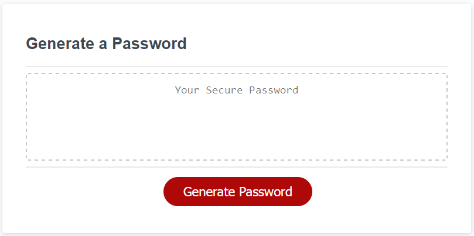

# JavaScript Password Generator

## Description
I wanted to make a password generator using javascript all through alerts, prompts, and confirms.

While creating this webapp I learned a lot about while loops, for loops, concating multiple specific strings together, and Math.floor Math.random methods.

---
## Installation

N/A

---
## Usage

Link to deployed project: [Click here!](https://t-willis.github.io/javascript-password-generator/)

Link to project repository (you're already there): [Click here!](https://github.com/t-willis/javascript-password-generator)

---

To use the webapp first click on the 'Generate Password' button then follow the prompts. You'll be asked to input a number between 8 and 128 and whether you would like to include or exclude lowercase letters, uppercase letters, numbers, and special characters.

After the required inputs have been entered you will be presented with your randomized password within the middle of the box.

---